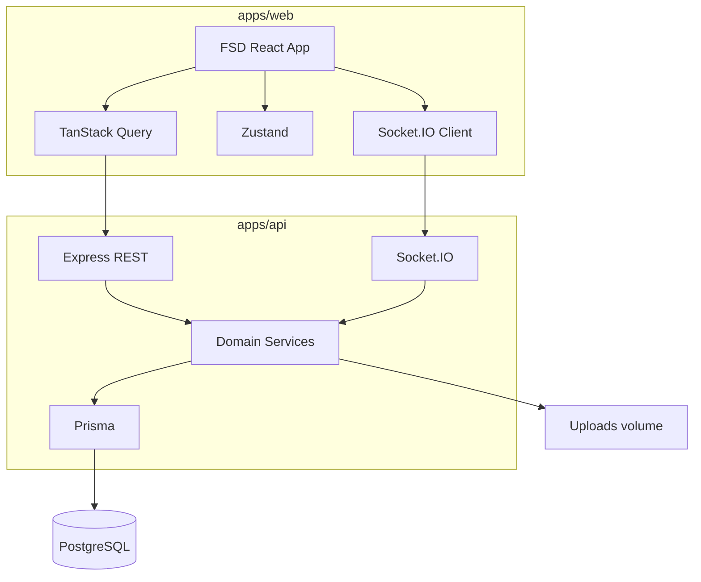
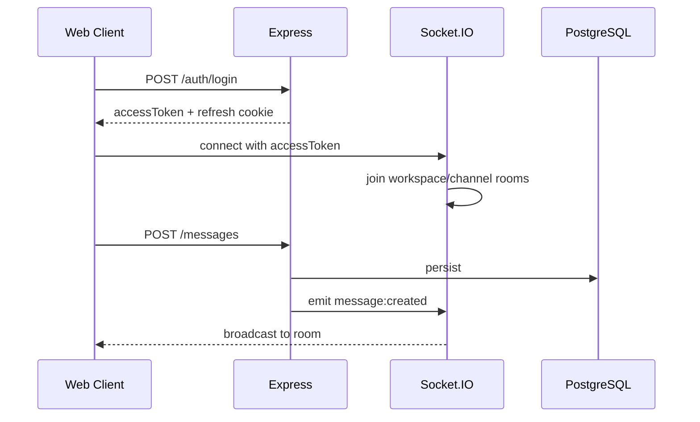

# Pulse

**Real-time team messenger with workspaces, channels, threads, and DMs — built as a production-shaped portfolio product.**

[](.github/workflows/ci.yml)
[](https://www.typescriptlang.org/)
[](LICENSE)

> Live demo: **placeholder** — repository is published on GitHub; no hosted deployment is configured by default.

## Demo credentials

After seeding:

- Email: `demo@pulse.app`
- Password: `Demo123!`

## Screenshots

Placeholders — add files under [`docs/screenshots`](docs/screenshots):

| Desktop | Dark | Mobile |
|---------|------|--------|
|  |  |  |

GIF/video demo: follow the recording checklist in [`docs/screenshots/README.md`](docs/screenshots/README.md), then drop `docs/demo.gif` here.

## Features

- Auth with JWT access + httpOnly refresh cookies
- Workspaces, roles (owner/admin/member), invites
- Public/private channels and direct/group conversations
- Real-time messages via Socket.IO
- Threads, reactions, mentions, attachments
- Search, in-app notifications, toasts
- Light/dark/system themes, EN/RU i18n
- Command palette (`Ctrl/Cmd+K`), responsive shell, WCAG-minded UI

## Tech stack

**Web:** React, TypeScript, Vite, React Router, TanStack Query, Zustand, Axios, RHF + Zod, Socket.IO Client, Tailwind, shadcn-style Radix UI, Storybook, Vitest, Playwright

**API:** Node.js, Express, Prisma, PostgreSQL, Socket.IO, Argon2, Helmet, rate limiting, Swagger UI

**Ops:** pnpm monorepo, Docker Compose, GitHub Actions CI, deploy workflow template

## Architecture



Socket flow:



More detail: [`docs/architecture.md`](docs/architecture.md), [`docs/data-model.md`](docs/data-model.md), [`docs/socket-events.md`](docs/socket-events.md).

## Project structure

```
apps/web          React SPA (Feature-Sliced Design)
apps/api          Express + Prisma + Socket.IO
packages/shared   Shared Zod schemas + DTO types
packages/config   Shared TSConfig bases
docs              Architecture notes and media placeholders
```

## Local development

Prerequisites: Node 20+, pnpm 9, and PostgreSQL (any one option below).

The root `.env` is loaded automatically by API / Prisma scripts (do not put secrets only in `apps/api`).

### 1. Environment

```bash
cp .env.example .env
pnpm install
pnpm --filter @pulse/shared build
```

### 2. Start PostgreSQL (pick one)

**A. Embedded Postgres (no Docker / no system install — recommended on Windows):**

```bash
# terminal 1 — keep running
pnpm db:embedded
```

**B. Docker (Postgres only):**

```bash
pnpm db:up
```

**C. Existing local PostgreSQL** — create DB/user matching `.env` (`pulse` / `pulse`).

### 3. Schema + seed + app

```bash
# terminal 2
pnpm setup
pnpm dev
```

Or step by step: `pnpm db:generate && pnpm db:push && pnpm db:seed && pnpm dev`

- Web: http://localhost:5173
- API: http://localhost:3001
- OpenAPI UI: http://localhost:3001/api/docs
- Demo login: `demo@pulse.app` / `Demo123!`

## Docker

```bash
cp .env.example .env
docker compose up --build
```

App: http://localhost:8080 · API: http://localhost:3001

## Environment variables

See [`.env.example`](.env.example). Never commit real secrets. Access tokens are never stored in `localStorage`.

## Testing

```bash
pnpm test
pnpm test:e2e
pnpm --filter @pulse/web storybook
```

## Deployment (template)

Deploy workflow is a **manual template** (`.github/workflows/deploy.yml`) for VPS + Docker Compose over SSH.

Required GitHub Secrets (when you choose to enable it):

- `SSH_HOST`
- `SSH_USER`
- `SSH_KEY`
- `DEPLOY_PATH`

This repository targets GitHub portfolio publishing; hosted live demo is optional.

## Security decisions

- Argon2 password hashing
- Refresh token rotation in httpOnly cookies
- Helmet, CORS allowlist, rate limits
- Server-side ACL for every sensitive operation
- Upload MIME/size checks
- Markdown sanitized with `rehype-sanitize`
- Prisma migrations / schema push for reproducible DB

## Performance decisions

- Route-based code splitting + lazy emoji picker
- TanStack Virtual for long message lists
- Debounced search
- Optimistic message send with rollback
- Axios abort via request `signal` on queries
- Bundle manual chunks for vendor/query/markdown

## Accessibility

- Skip link, semantic landmarks, labeled inputs
- Keyboard-accessible dialogs/menus (Radix)
- Icon-only buttons expose `aria-label`
- `prefers-reduced-motion` respected in CSS
- Errors announced via `role="alert"`

## Trade-offs

- Local disk uploads instead of S3 (simpler self-host demo)
- ILIKE search instead of Elasticsearch
- Presence is in-memory (single API instance)
- Email invites create tokens/links; outbound email provider is not wired

## Roadmap

- [ ] Outbound email for invites
- [ ] Object storage for attachments
- [ ] Multi-instance presence via Redis
- [ ] Message bookmarks and pins
- [ ] Hosted demo environment

## Contributing

1. Use Conventional Commits (`feat:`, `fix:`, `docs:`, …)
2. Run `pnpm lint`, `pnpm typecheck`, `pnpm test` before opening a PR
3. Keep FSD public APIs via `index.ts`

## License

MIT
